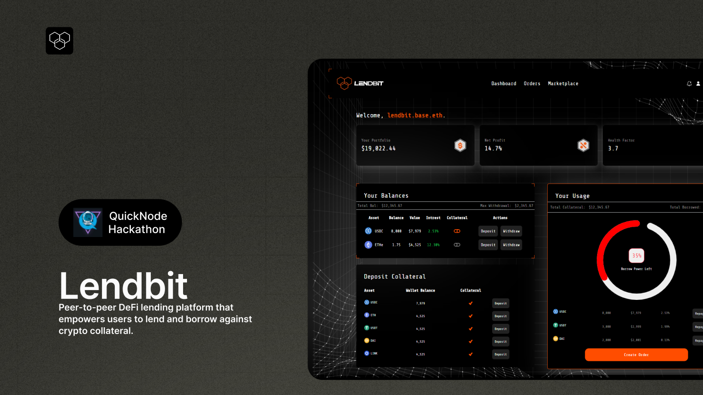

# Lendbit: Decentralized P2P Lending and Borrowing Platform



## Overview

Lendbit is a decentralized peer-to-peer (P2P) lending and borrowing platform that empowers users with full control over their financial assets, using smart contracts and decentralized finance (DeFi) principles. The frontend of Lendbit is built with **Next.js** to provide a seamless and efficient user experience, integrating features such as **basename** routing and **smart wallet** functionality.

### Key Features

- **Next.js Framework**: Optimized for speed and SEO, delivering a dynamic and responsive user interface.
- **Smart Wallet Integration**: Users can securely interact with the platform using smart wallets for gas-efficient transactions and enhanced security.
- **Basename Support**: Enables deployment flexibility, allowing the app to be hosted on subdomains or specific paths.
- **P2P Loan Interaction**: Borrowers can browse loan offers, and lenders can customize loan terms directly within the interface.
- **Collateral Management**: Easily manage token deposits, loan health, and automated liquidation.

## Running the Project Locally

To run the Lendbit frontend locally:

1. Clone the repository and install dependencies:

   ```bash
   git clone https://github.com/lendbit/frontend.git
   cd frontend
   npm install
   ```

2. Start the development server:

   ```bash
   npm run dev
   ```

3. Open your browser and navigate to `http://localhost:3000`.

Make sure your wallet is connected and set to the correct network (e.g., Ethereum or Celo) when interacting with the app.

## Deployment

For production deployment, you can build the project and deploy it to services such as Vercel or Netlify:

1. Build the project:

   ```bash
   npm run build
   ```

2. Deploy the built project using your preferred hosting platform.

Ensure that the **basename** is correctly set for the deployment environment.

## Contributing

We welcome contributions! To get started:

1. Fork this repository.
2. Create a branch for your feature or bugfix.
3. Submit a pull request with a clear explanation of your changes.

## Support

If you encounter issues or need assistance, feel free to reach out:

- Email: support@lendbit.com
- Community: [Join our Discord](https://discord.com/invite/lendbit)

---

This README provides a clear guide for setting up and working with the **Next.js** frontend for Lendbit. Let me know if there’s anything else you'd like to add or modify!


This is a [Next.js](https://nextjs.org) project bootstrapped with [`create-next-app`](https://nextjs.org/docs/app/api-reference/cli/create-next-app).

## Getting Started

First, run the development server:

```bash
npm run dev
# or
yarn dev
# or
pnpm dev
# or
bun dev
```

Open [http://localhost:3000](http://localhost:3000) with your browser to see the result.

You can start editing the page by modifying `app/page.tsx`. The page auto-updates as you edit the file.

This project uses [`next/font`](https://nextjs.org/docs/app/building-your-application/optimizing/fonts) to automatically optimize and load [Geist](https://vercel.com/font), a new font family for Vercel.

## Learn More

To learn more about Next.js, take a look at the following resources:

- [Next.js Documentation](https://nextjs.org/docs) - learn about Next.js features and API.
- [Learn Next.js](https://nextjs.org/learn) - an interactive Next.js tutorial.

You can check out [the Next.js GitHub repository](https://github.com/vercel/next.js) - your feedback and contributions are welcome!

## Deploy on Vercel

The easiest way to deploy your Next.js app is to use the [Vercel Platform](https://vercel.com/new?utm_medium=default-template&filter=next.js&utm_source=create-next-app&utm_campaign=create-next-app-readme) from the creators of Next.js.

Check out our [Next.js deployment documentation](https://nextjs.org/docs/app/building-your-application/deploying) for more details.
